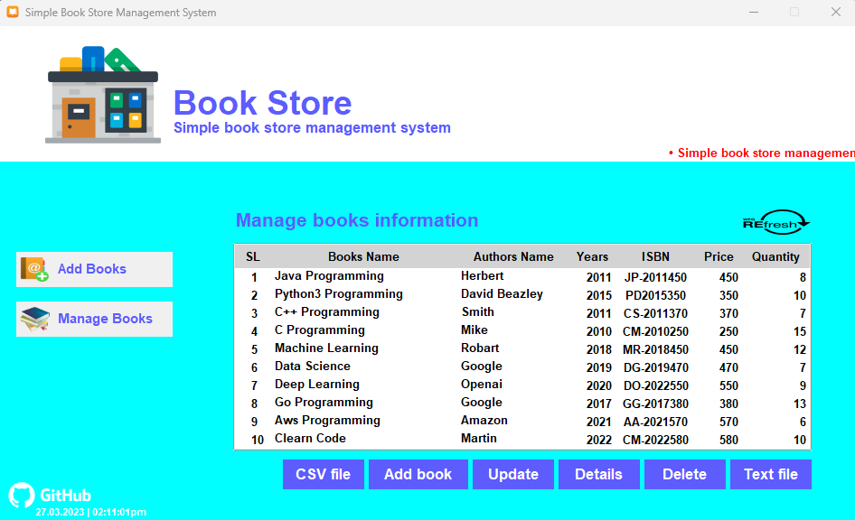
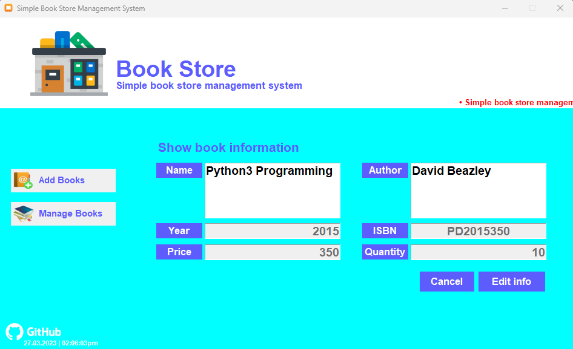
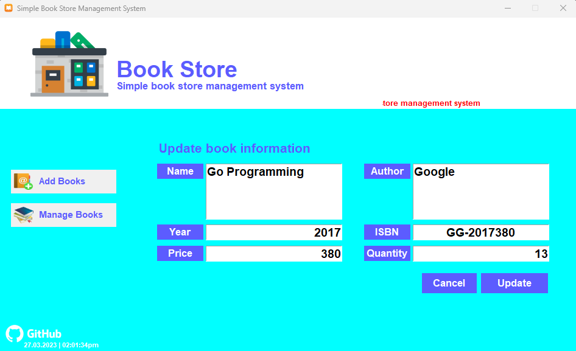
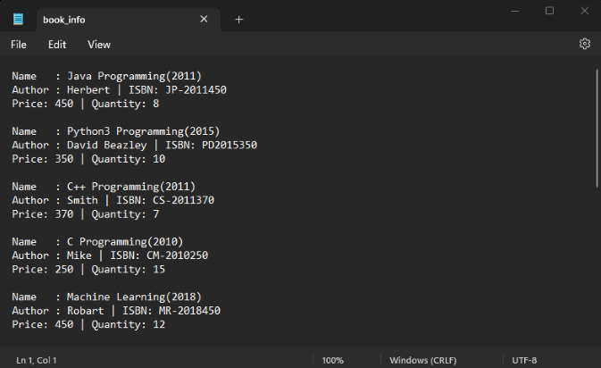
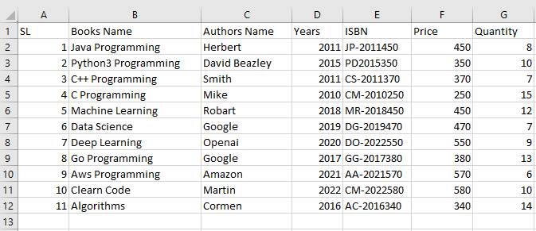

# Simple Book Store Management System

### **A Python-based _simple book store management system_ using Tkinter GUI and SQLite database**

Tkinter is a Python binding to the Tk GUI toolkit. It is the standard Python interface to the Tk GUI toolkit, and is Python's defacto standard GUI.

## Task Description

A project to build a Python-based simple book store management system. Here add book into database to give information. Then manage book information like as show details, update book information, delete book information and write book information to [CSV](https://docs.python.org/3/library/csv.html) and [TXT](https://en.wikipedia.org/wiki/Text_file) file. Here are some special features added.

* **Text scrolling system**
* **Running time clock**

## Task Requirments
this project is developed using all new os, software and tools.

* **Operating System :** Windows11, Kali Linux2025.2
* **Software :** Python3.13, Visual Studio Code
* **GUI Library :** Tkinter (`Default`) 

## Installation

First [Download](https://www.python.org/downloads/), install and configure [Python](https://www.python.org/doc/). Then use the package manager [pip](https://pip.pypa.io/en/stable/) to install on.

* Windows installation
* Kali linux installation
* Mac installation

**Note:** If the table data is not automatically refreshed then refresh the data table by pressing the _`REfresh`_ button.

## Sreenshots
Here are some screenshots of the `Book Store System` project:

**Main application page** 
 
**Add new book** 
 
**Manage book** 
 
**Show book details** 
 
**Update book info** 
 
**TXT file output** 
 
**CSV file output** 
 

## Contributing

Contributions, suggestions, and feedback are always welcome! 
To contribute:

1. Fork the repository
1. Create a new branch (`feature/new-feature`)
1. Commit your changes
1. Push and submit a Pull Request

💬 You can also open an issue if you’d like to discuss a feature or report a bug.

## For more or connect with me

  &nbsp;&nbsp;
  &nbsp;&nbsp;
  &nbsp;&nbsp;
  

## License

The [MIT](https://choosealicense.com/licenses/mit/) License (MIT)

## Thank You for Visiting!

> “Good design is about making things simple yet significant”  
> — *Md. Ariful Islam*